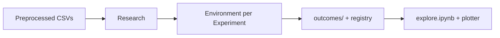
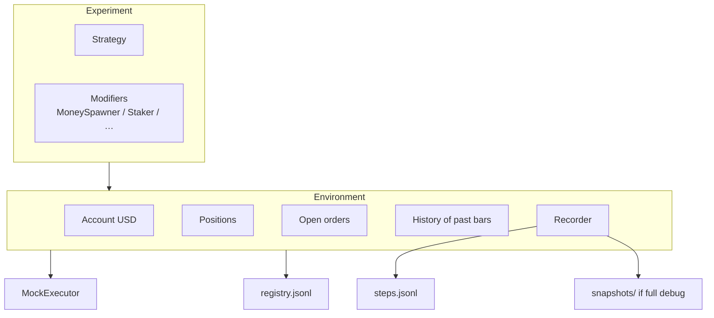
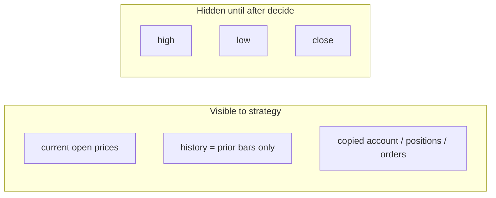
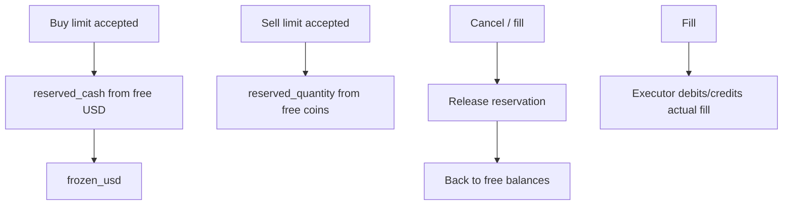
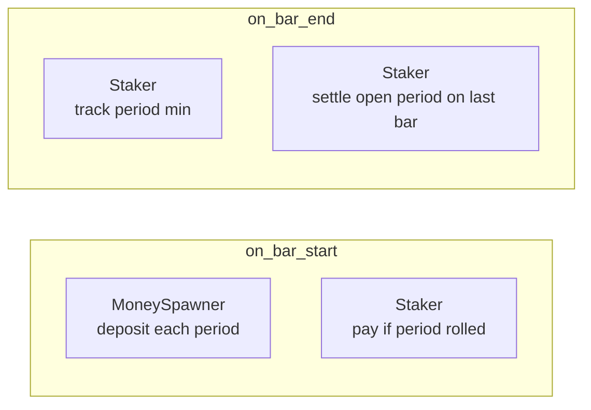
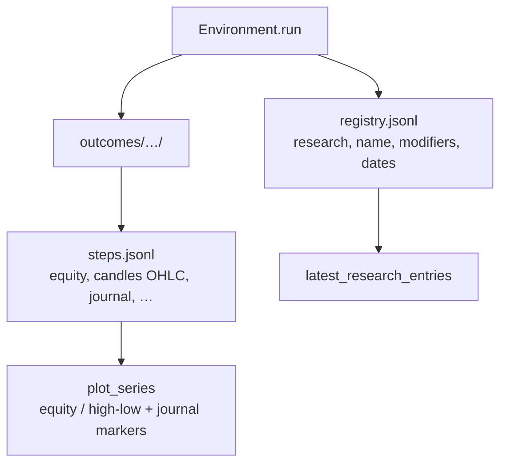

# Investment Lab

**Simulate. Analyze. Invest.**

A Python lab for simulating investment strategies on historical market data, inspecting outcomes, and comparing results.

## What it does

- Run strategies bar-by-bar against OHLC candles (market and limit orders)
- Track cash, positions, open orders, and mark-to-market equity
- Save each outcome under `strat_runner/outcomes/` with a searchable registry
- Explore equity and OHLC (high/low) in an interactive Plotly notebook

## How it works

For each day: modifiers may move cash → strategy decides from the **open** → orders fill against that day’s candle → modifiers observe again → equity and a journal line are saved for the explore notebook.

### Big picture



`Research` runs many `Experiment`s on the same data window under one `research_id`. Each experiment is a strategy plus optional modifiers.

### Main pieces



### One bar

```mermaid
sequenceDiagram
  participant Mod as Modifiers
  participant Strat as Strategy
  participant Env as Environment
  participant Ex as MockExecutor

  Note over Env: Bar opens (open prices known)
  Env->>Mod: on_bar_start(ctx)
  Mod-->>Env: journal entries (deposit / interest…)

  Env->>Strat: decide(Context)
  Note over Strat: Sees opens + past bars only<br/>Not current high/low/close
  Strat-->>Env: Decision(orders, cancels)

  Env->>Env: apply cancels
  Env->>Env: accept market orders into open_orders
  Env->>Env: append bar to history
  Env->>Ex: fill open orders vs this bar OHLC
  Note over Ex: Market @ close<br/>Limit if touched / gap @ open
  Ex-->>Env: Fills → journal
  Env->>Env: accept new limit orders (rest; no fill today)

  Env->>Mod: on_bar_end(ctx)
  Mod-->>Env: journal (e.g. Staker observe / final interest)

  Env->>Env: mark equity @ close
  Env->>Env: record step (candles, balances, journal, …)
```

Step by step:

1. Modifiers `on_bar_start` (e.g. `MoneySpawner`, period-roll `Staker` interest)
2. Strategy `decide` — **current open** prices and **past bars only** (no current OHLC in history)
3. Cancels apply; new **market** orders are accepted
4. Current bar is appended to history
5. Open orders fill against the current bar (markets at **close**; limits when touched, at limit or gap-through **open**)
6. New **limit** orders rest — not eligible to fill until a later bar
7. Modifiers `on_bar_end` (e.g. `Staker` observes min; final interest on last bar)
8. Equity is marked to market at close

Rule of thumb: **decide at the open, market fills at the close, new limits wait for a later bar.**

### What the strategy sees



### Cash locks on resting limits



### Modifiers



Same `Experiment.modifiers` list; unused hooks return nothing.

### Outputs → analysis



## Cash and resting orders

Resting limits lock funds on the order when accepted:

**Buy limits** (`reserved_cash`):
- Free USD (`account.balances["USD"]`) is reduced by the lock
- `Environment.frozen_usd` sums all cash locks
- Cancel unlocks back to free USD
- Fill unlocks, then debits the actual fill cost (cheaper gap fills return leftover to free)
- Lock size: `quantity * limit_price`, or `total_value` when value-sized

**Sell limits** (`reserved_quantity`):
- Free position quantity is reduced by the lock (coins stay in equity via the reservation)
- `Environment.frozen_quantity(ticker)` sums coin locks for that asset
- Context / step `positions` show only free (unreserved) quantity
- Cancel unlocks coins back to the position
- Fill unlocks, then the executor sells the fill size
- Lock size: `quantity`, or `total_value / limit_price` when value-sized

Equity = free USD + frozen USD + free position value + reserved coin value.

## Experiment modifiers

Account-side hooks on an `Experiment` via `modifiers=[...]`. Each modifier may implement:

- `on_bar_start(ctx)` — before strategy decide
- `on_bar_end(ctx)` — after fills / resting limits

`MoneySpawner` deposits on period boundaries in `on_bar_start`. `Staker` (one ticker each) tracks the period’s **minimum available** balance (free cash or free position qty), pays on period roll in `on_bar_start`, observes in `on_bar_end`, and settles the open period on the last bar.

```python
Experiment(
    strategy=DoNothingStrategy(),
    modifiers=[
        MoneySpawner(currency="USD", amount=1000, interval=SpawnInterval.MONTH),
        Staker(ticker="USD", rate="0.004", interval=SpawnInterval.MONTH),
        Staker(ticker="BTC", rate="0.002", interval=SpawnInterval.MONTH),
    ],
)
```

## Setup

Requires **Python 3.14+**.

```bash
source virt_env_314/bin/activate
python -m pip install -U pip
python -m pip install -r requirements.txt
```

## Run a simulation

From the repo root, with the venv active:

```bash
cd strat_runner
python main.py
```

Outcomes are written to `strat_runner/outcomes/` and indexed in `outcomes/registry.jsonl`. Each `steps.jsonl` row stores that bar’s OHLC per ticker under `candles` (no volume); equity is still marked at close.

## Explore results

```bash
cd strat_runner/analysis
jupyter lab explore.ipynb
```

The notebook loads the latest research batch (`load_research("hold-vs-buybelow")`) and plots every experiment side by side. Filter registry entries with `latest_entry(...)` / `find_entries(...)` (`strategy`, `assets`, `params`, `start_date`, `end_date`, `id`, `folder`, `research`, `name`) for a single outcome.

## Tests

From the repo root:

```bash
pytest -q
```

## Project layout

```
strat_runner/
  main.py              # sample simulation entrypoint
  models.py            # Candle, Order, Decision, Context, …
  engine/              # Environment, Experiment, Research, registry, recorder
  strategies/          # Hold, BuyBelow, …
  executors/           # MockExecutor fill logic
  data/                # loaders, downloaders, preprocessed CSVs
  analysis/            # explore.ipynb + plotter
  outcomes/            # simulation outputs + registry
  tests/
```

## Strategies

Strategies implement `decide(context) -> Decision | None`:

- **`DoNothingStrategy`** — keep USD idle; never places orders
- **`HoldStrategy`** — market-buy available USD once when the ticker is present
- **`InvestEverythingStrategy`** — market-buy all available USD whenever funds appear
- **`BuyBelowStrategy`** — rest a limit buy at a target price

`Context` exposes a **copy** of history (past bars only), current open prices, account, positions, and open orders — mutating it does not change the environment. Return `Decision(orders=..., cancel_order_ids=...)` or `None` for a no-op.

## Experiments

Pass an `Experiment` into `Environment` instead of a bare strategy:

```python
from engine import Experiment, MoneySpawner, SpawnInterval

Experiment(
    strategy=BuyBelowStrategy(target_price=20000, ticker="BTC"),
    modifiers=[
        MoneySpawner(
            currency="USD",
            amount=1000,
            interval=SpawnInterval.MONTH,
        ),
    ],
    name="buybelow+spawn",
)
```

The registry stores `name`, strategy metadata, and `modifiers` config. Applied changes are logged on each step as a `journal` of typed `entries` (deposits, interest, fills, cancellations, …).

## Research

Group experiments into a named research batch so they share one `research_id` and load together:

```python
from engine import Experiment, Research

Research(
    name="hold-vs-buybelow",
    experiments=[
        Experiment(strategy=HoldStrategy(ticker="BTC"), name="hold"),
        Experiment(strategy=BuyBelowStrategy(target_price=20000, ticker="BTC"), name="buybelow"),
    ],
).run(
    data_files,
    start_date="2023-01-01",
    end_date="2024-12-31",
    initial_usd=10_000,
)
```

`initial_usd` is shared across the batch (same idea as the date window). `latest_research_entries(outcomes_dir, "hold-vs-buybelow")` returns every outcome from the most recent run of that research.

## Backlog

- Money Burner
- Show more charts
- Journal markers on charts (fills, deposits, …) — partially done
- Implement leverage
- Implement fees
- implement futures so you can short